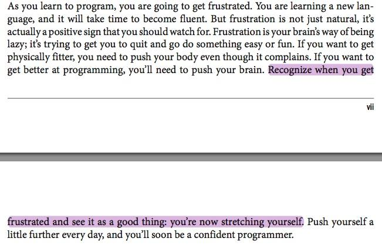
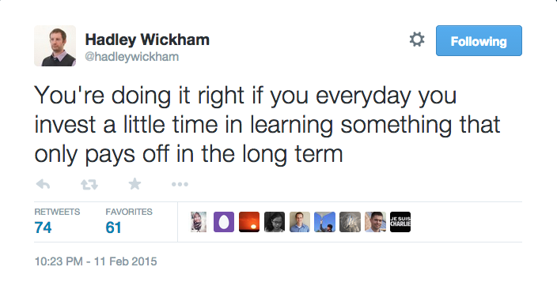
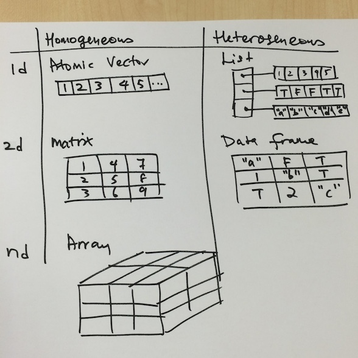

R Programming - Part 2
========================================================
author: Eugene Teo
date: February 9th, 2015

Who am i?
========================================================


[@eugeneteo](http://www.twitter.com/eugeneteo)

Learning frustrations
========================================================



[https://twitter.com/dsquintana/status/509654633464471552](https://twitter.com/dsquintana/status/509654633464471552)

Invest a little time
========================================================



[https://twitter.com/hadleywickham/status/565516534089785344](https://twitter.com/hadleywickham/status/565516534089785344)

Refresher
========================================================

Coding convention used in these slides


```r
(x <- c(1, 2, 3, 4)) # preferred method
```

```
[1] 1 2 3 4
```

is the same as


```r
x <- c(1, 2, 3, 4)
x
```

```
[1] 1 2 3 4
```

Refresher
========================================================



Refresher
========================================================


```r
(x <- matrix(1:6, nrow = 2, ncol = 3))
```

```
     [,1] [,2] [,3]
[1,]    1    3    5
[2,]    2    4    6
```

```r
seq_len(nrow(x)) # indices of x's rows
```

```
[1] 1 2
```

```r
seq_len(ncol(x)) # indices of x's columns
```

```
[1] 1 2 3
```

Refresher
========================================================


```r
(x <- matrix(1:6, nrow = 2, ncol = 3))
```

```
     [,1] [,2] [,3]
[1,]    1    3    5
[2,]    2    4    6
```

```r
x[1, 2] # x[row, column]
```

```
[1] 3
```

```r
x[2, 3]
```

```
[1] 6
```

Refresher
========================================================


```r
(x <- matrix(1:6, nrow = 2, ncol = 3))
```

```
     [,1] [,2] [,3]
[1,]    1    3    5
[2,]    2    4    6
```

```r
for (a in seq_len(nrow(x))) # 1 2
   for (b in seq_len(ncol(x))) # 1 2 3
      print(x[a, b])
```

```
[1] 1
[1] 3
[1] 5
[1] 2
[1] 4
[1] 6
```

Week 3
========================================================
Loop functions

Loop Functions
========================================================

The use of functionals is an alternative to for-loops

* ```lapply()``` (loops a list and returns a list)
* ```sapply()``` (simplies the result of ```lapply``` if possible by returning a vector or matrix or list of values)
* ```apply()``` (applies a function to margins of an array or matrix, and returns a vector or array or list of values)
* ```tapply()``` (applies a function to groups of data)
* ```mapply()``` (applies a function to multiple list or vector arguments)

Loop functions - lapply
========================================================

Applies a function over a list or vector


```r
lapply
```

```
function (X, FUN, ...) 
{
    FUN <- match.fun(FUN)
    if (!is.vector(X) || is.object(X)) 
        X <- as.list(X)
    .Internal(lapply(X, FUN))
}
<bytecode: 0x7fbe59934508>
<environment: namespace:base>
```

Loop functions
========================================================


```r
(x <- list(a = 1:3, b = rnorm(3)))
```

```
$a
[1] 1 2 3

$b
[1] -0.06331  1.59713  1.94097
```

```r
for (a in 1:length(x)) { # 1:2
   print(mean(x[[a]])) # remember [[?]]?
}
```

```
[1] 2
[1] 1.158
```

Loop functions - lapply
========================================================


```r
(x <- list(a = 1:3, b = rnorm(3)))
```

```
$a
[1] 1 2 3

$b
[1]  2.41059  0.35056 -0.01228
```

```r
lapply(x, mean) # mean(x$a) and mean(x$b)
```

```
$a
[1] 2

$b
[1] 0.9163
```

Loop functions - lapply
========================================================

```runif()``` generates random deviates


```r
x <- 1:3 # number of observations
lapply(x, runif) # runif(n, min = 0, max = 1)
```

```
[[1]]
[1] 0.6476

[[2]]
[1] 0.7777 0.2263

[[3]]
[1] 0.9976 0.4284 0.3140
```

Loop functions - lapply
========================================================


```r
(x <- list(a = matrix(1:4, nrow=2, ncol=2),
          b = matrix(1:6, nrow=3, ncol=2)))
```

```
$a
     [,1] [,2]
[1,]    1    3
[2,]    2    4

$b
     [,1] [,2]
[1,]    1    4
[2,]    2    5
[3,]    3    6
```

Loop functions - lapply
========================================================


```r
x <- list(a = matrix(1:4, nrow=2, ncol=2),
          b = matrix(1:6, nrow=3, ncol=2))
# show column 1 in matrix format
lapply(x, function(elt) elt[, 1, drop = F])
```

```
$a
     [,1]
[1,]    1
[2,]    2

$b
     [,1]
[1,]    1
[2,]    2
[3,]    3
```

Loop functions - sapply
========================================================

```sapply()``` simplies the result of ```lapply()``` if possible

* If the result is a list where every element is length 1, then a vector is returned
* If the result is a list where every element is a vector of the same length (>1), a matrix is returned
* If the result is a list where every element is of different types or lengths, it will silently return a list

Loop functions - sapply
========================================================


```r
data(mtcars) # in-built dataset
str(mtcars[1, ]) # first row
```

```
'data.frame':	1 obs. of  11 variables:
 $ mpg : num 21
 $ cyl : num 6
 $ disp: num 160
 $ hp  : num 110
 $ drat: num 3.9
 $ wt  : num 2.62
 $ qsec: num 16.5
 $ vs  : num 0
 $ am  : num 1
 $ gear: num 4
 $ carb: num 4
```

Loop functions - sapply
========================================================

If the result is a list where every element is length 1, then a vector is returned


```r
data(mtcars) # in-built dataset
# mtcars[1, ] # show first row
sapply(mtcars, is.numeric) # returns a vector
```

```
 mpg  cyl disp   hp drat   wt qsec   vs   am gear carb 
TRUE TRUE TRUE TRUE TRUE TRUE TRUE TRUE TRUE TRUE TRUE 
```

Loop functions - sapply
========================================================

If the result is a list where every element is a vector of the same length (>1), a matrix is returned


```r
x <- c(8, 8, 8) # 3 columns of 8 observations
sapply(x, runif) # runif(8, min = 0, max = 1)
```

```
        [,1]   [,2]   [,3]
[1,] 0.44699 0.2540 0.1084
[2,] 0.90662 0.8159 0.8852
[3,] 0.04765 0.6212 0.7624
[4,] 0.27996 0.6961 0.7917
[5,] 0.60085 0.7474 0.8297
[6,] 0.26552 0.7800 0.9081
[7,] 0.65968 0.5381 0.4563
[8,] 0.72746 0.3930 0.9527
```

Loop functions - sapply
========================================================


```r
(x <- data.frame(x = 1:10, y = Sys.time() + 1:10)) # plus 1:10 secs
```

```
    x                   y
1   1 2015-02-16 11:33:50
2   2 2015-02-16 11:33:51
3   3 2015-02-16 11:33:52
4   4 2015-02-16 11:33:53
5   5 2015-02-16 11:33:54
6   6 2015-02-16 11:33:55
7   7 2015-02-16 11:33:56
8   8 2015-02-16 11:33:57
9   9 2015-02-16 11:33:58
10 10 2015-02-16 11:33:59
```

Loop functions - sapply
========================================================

If the result is a list where every element is of different types or lengths, it will silently return a list


```r
x <- data.frame(x = 1:10, y = Sys.time() + 1:10)
sapply(x, class) # returns a list
```

```
$x
[1] "integer"

$y
[1] "POSIXct" "POSIXt" 
```

Loop functions - apply
========================================================

Applies a function to margins of an array or matrix, and returns a vector or array or list of values


```r
str(apply)
```

```
function (X, MARGIN, FUN, ...)  
```

```MARGIN``` is a vector giving the subscripts which the function will be applied over:
* ```1``` indicates rows
* ```2``` indicates columns
* ```c(1, 2)``` indicates rows and columns

Loop functions - apply
========================================================


```r
(x <- matrix(1:16, nrow = 2))
```

```
     [,1] [,2] [,3] [,4] [,5] [,6] [,7] [,8]
[1,]    1    3    5    7    9   11   13   15
[2,]    2    4    6    8   10   12   14   16
```

```r
apply(x, 1, mean) # row
```

```
[1] 8 9
```

```r
apply(x, 2, mean) # col
```

```
[1]  1.5  3.5  5.5  7.5  9.5 11.5 13.5 15.5
```

Loop functions - apply
========================================================

```quantile()``` provides the sample quantiles based on the given probabilities


```r
# quantile(x, probs = seq(0, 1, 0.25),
#          na.rm = FALSE, names = TRUE,
#          type = 7, ...)
quantile
```

```
function (x, ...) 
UseMethod("quantile")
<bytecode: 0x7fbe5ab8d378>
<environment: namespace:stats>
```

Loop functions - apply
========================================================


```r
(x <- matrix(rnorm(15), ncol = 3))
```

```
        [,1]     [,2]    [,3]
[1,] -0.3405 -0.84050  0.6304
[2,]  0.6197  1.05733  1.9130
[3,] -1.3135  0.08270 -1.0532
[4,] -0.7158 -1.58314  1.9523
[5,]  0.1471 -0.01433 -0.3095
```

```r
apply(x, 2, quantile, probs = c(0.25, 0.75))
```

```
       [,1]    [,2]    [,3]
25% -0.7158 -0.8405 -0.3095
75%  0.1471  0.0827  1.9130
```

Loop functions - tapply
========================================================

Applies a function to groups of data using a grouping factor


```r
str(tapply)
```

```
function (X, INDEX, FUN = NULL, ..., simplify = TRUE)  
```

```X``` is a vector and ```INDEX``` is a grouping factor. The function should expect one argument, which is a vector of elements taken from x according to their group

Loop functions - tapply
========================================================


```r
data(Orange) # Growth of Orange Trees
Orange[1:10, ]
```

```
   Tree  age circumference
1     1  118            30
2     1  484            58
3     1  664            87
4     1 1004           115
5     1 1231           120
6     1 1372           142
7     1 1582           145
8     2  118            33
9     2  484            69
10    2  664           111
```

Loop functions - tapply
========================================================


```r
data(Orange) # Growth of Orange Trees
str(Orange$Tree)
```

```
 Ord.factor w/ 5 levels "3"<"1"<"5"<"2"<..: 2 2 2 2 2 2 2 4 4 4 ...
```

```r
levels(Orange$Tree)
```

```
[1] "3" "1" "5" "2" "4"
```

```r
nlevels(Orange$Tree)
```

```
[1] 5
```

Loop functions - tapply
========================================================


```r
data(Orange) # Growth of Orange Trees
tapply(Orange$circumference, Orange$Tree, mean) # returns an array
```

```
     3      1      5      2      4 
 94.00  99.57 111.14 135.29 139.29 
```

If ```simplify``` = ```FALSE``` (not the default), it will return a list

Loop functions - tapply
========================================================


```r
# 20x standard normals, 10x random deviates
x <- c(rnorm(10), runif(10), rnorm(10, 1))
# generate factor levels
(f <- gl(3, 10)) # 3 = levels, 10 = replications
```

```
 [1] 1 1 1 1 1 1 1 1 1 1 2 2 2 2 2 2 2 2 2 2 3 3 3 3 3 3 3 3 3 3
Levels: 1 2 3
```

```r
tapply(x, f, mean)
```

```
     1      2      3 
0.2715 0.5185 1.4648 
```

Loop functions - tapply
========================================================

Returns a list instead of an array, see ```simplify = FALSE```


```r
x <- c(rnorm(10), runif(10), rnorm(10, 1))
f <- gl(3, 10)
tapply(x, f, mean, simplify = FALSE)
```

```
$`1`
[1] 0.08655

$`2`
[1] 0.5275

$`3`
[1] 1.118
```

Loop functions - tapply
========================================================

```range()``` returns a vector of min and max


```r
x <- c(rnorm(10), runif(10), rnorm(10, 1))
f <- gl(3, 10)
# returns an array with the mode of the scalar
tapply(x, f, range)
```

```
$`1`
[1] -2.0849  0.8517

$`2`
[1] 0.02398 0.88222

$`3`
[1] -0.7537  2.8663
```

Loop functions - mapply
========================================================

Applies a function to multiple list or vector arguments


```r
str(mapply)
```

```
function (FUN, ..., MoreArgs = NULL, SIMPLIFY = TRUE, USE.NAMES = TRUE)  
```

Loop functions - mapply
========================================================


```r
mapply(rep, 1:3, 3:1)
```

```
[[1]]
[1] 1 1 1

[[2]]
[1] 2 2

[[3]]
[1] 3
```

```r
# rep(1, 3) [1], 2, 3  [3], 2, 1
# rep(2, 2) 1, [2], 3  3, [2], 1
# rep(3, 1) 1, 2, [3]  3, 2, [1]
```

Loop functions - mapply
========================================================


```r
l1 <- list(a = c(1:10), b = c(11:20))
l2 <- list(c = c(21:30), d = c(31:40))
# sum the corresponding elements of l1 and l2
mapply(sum, l1$a, l1$b, l2$c, l2$d)
```

```
 [1]  64  68  72  76  80  84  88  92  96 100
```

```r
# sum(1, 11, 21, 31) = 64
# sum(2, 12, 22, 32) = 68
# sum(3, 13, 23, 33) = 72
# ...
# sum(8, 18, 28, 38) = 92
# sum(9, 19, 29, 39) = 96
# sum(10, 20, 30, 40) = 100
```

Loop functions - split
========================================================

Takes a vector or other objects and splits it into groups determined by a factor or list of factors


```r
str(split)
```

```
function (x, f, drop = FALSE, ...)  
```

```x``` is a vector or data frame containing values to be dividend into groups

```f``` is a factor (or coerced to one) or a list of factors

```drop``` indicates if empty factor levels should be dropped. FALSE by default

Loop functions - split
========================================================


```r
x <- c(rnorm(5), runif(5), rnorm(5, 1))
f <- gl(3, 5) # 3 levels, 5 replications
split(x, f) # returns a list of vectors
```

```
$`1`
[1] -0.9669 -0.9608 -1.1150 -0.7015 -0.2848

$`2`
[1] 0.05457 0.99981 0.85727 0.59342 0.92627

$`3`
[1] -0.1541  3.1983  1.5027  2.6935  1.1225
```

Loop functions - split
========================================================


```r
x <- c(rnorm(5), runif(5), rnorm(5, 1))
f <- gl(3, 5) # 3 levels, 5 replications
lapply(split(x, f), mean)
```

```
$`1`
[1] 0.1632

$`2`
[1] 0.4515

$`3`
[1] 0.8743
```

Loop functions - split
========================================================


```r
data(airquality)
str(airquality$Month)
```

```
 int [1:153] 5 5 5 5 5 5 5 5 5 5 ...
```

```r
table(airquality$Month)
```

```

 5  6  7  8  9 
31 30 31 31 30 
```

Loop functions - split
========================================================


```r
head((s <- split(airquality, airquality$Month))$`5`) # May
```

```
  Ozone Solar.R Wind Temp Month Day
1    41     190  7.4   67     5   1
2    36     118  8.0   72     5   2
3    12     149 12.6   74     5   3
4    18     313 11.5   62     5   4
5    NA      NA 14.3   56     5   5
6    28      NA 14.9   66     5   6
```

Loop functions - split
========================================================


```r
data(airquality)
s <- split(airquality, airquality$Month)
# column mean
sapply(s,
       function(x) {
          apply(x[, c("Ozone", "Solar.R",
                      "Wind", "Temp")],
                2, mean, na.rm = TRUE)
       }
)
```

```
             5      6       7       8      9
Ozone    23.62  29.44  59.115  59.962  31.45
Solar.R 181.30 190.17 216.484 171.857 167.43
Wind     11.62  10.27   8.942   8.794  10.18
Temp     65.55  79.10  83.903  83.968  76.90
```

Optional - Loop functions - split
========================================================


```r
x <- 1:10
(f1 <- gl(2, 5)) # 2 - levels, 5 - repl
```

```
 [1] 1 1 1 1 1 2 2 2 2 2
Levels: 1 2
```

```r
f2 <- gl(5, 2) # 5 - levels, 2 - replications
interaction(f1, f2) # Factor interactions
```

```
 [1] 1.1 1.1 1.2 1.2 1.3 2.3 2.4 2.4 2.5 2.5
Levels: 1.1 2.1 1.2 2.2 1.3 2.3 1.4 2.4 1.5 2.5
```

Optional - Loop functions - split
========================================================


```r
x <- 1:10
f1 <- gl(2, 5) # 2 - levels, 5 - repl
f2 <- gl(5, 2)
str(split(x, list(f1, f2)))
```

```
List of 10
 $ 1.1: int [1:2] 1 2
 $ 2.1: int(0) 
 $ 1.2: int [1:2] 3 4
 $ 2.2: int(0) 
 $ 1.3: int 5
 $ 2.3: int 6
 $ 1.4: int(0) 
 $ 2.4: int [1:2] 7 8
 $ 1.5: int(0) 
 $ 2.5: int [1:2] 9 10
```

Optional - Loop functions - split
========================================================

Explanation:


```r
# f1 = 11 11 1 2 22 22
# f2 = 11 22 3 3 44 55
# x  = 12 34 5 6 78 910
#       2  2 1 1  2  2
# There's 1.1, 1.2, 1.3, 2.3, 2.4, and 2.5
# There's no 2.1, 2.2, 1.4, and 1.5
```

Read [Splitting on more than one level](https://class.coursera.org/rprog-010/forum/thread?thread_id=1071)

Not covering
========================================================

Debugging tools and R profiling

References
========================================================

[R Programming](https://www.coursera.org/course/rprog) by Roger D. Peng, Jeff Leek and Brian Caffo

[Advanced R](http://www.amazon.com/Advanced-Chapman-Hall-Hadley-Wickham/dp/1466586966/) by Hadley Wickham

[R Cookbook](http://www.amazon.com/Cookbook-OReilly-Cookbooks-Paul-Teetor/dp/0596809158/) by Paul Teetor

[A brief introduction to “apply” in R](https://nsaunders.wordpress.com/2010/08/20/a-brief-introduction-to-apply-in-r/) by Neil Saunders

[R tapply Function](http://www.endmemo.com/program/R/tapply.php) by endmemo.com

Repositories
========================================================

[https://github.com/eugeneteo/ida-mooc-rprog1](https://github.com/eugeneteo/ida-mooc-rprog1)

[https://github.com/eugeneteo/ida-mooc-rprog2](https://github.com/eugeneteo/ida-mooc-rprog2)

Thanks
========================================================

Join the [first](https://www.facebook.com/groups/iDADataSciMOOC/) and [second](https://www.facebook.com/groups/datascienceJOHNS/) cohorts' Facebook groups!

[@eugeneteo](http://www.twitter.com/eugeneteo)
